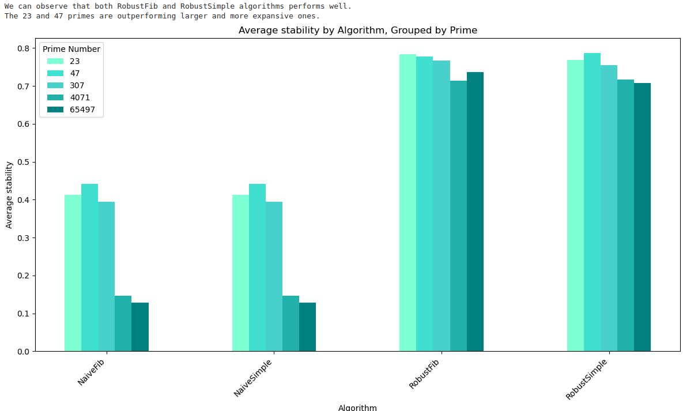

# rlt

`RLT` stands for Robust Lookup Table.
The `RLT` algorithm is defined in `internal/adapter/bpf/ebpf_lookuptable.go`.

## Benchmark analysis

TODO: Please calculate variance per algorithm and draw it. We obviously want
to choose an algorithm with a lower variance.

[Benchmark analysis notebook](./rlt-benchmark.ipynb)

## Robust Lookup Table: AI Model

The goal would be to replace the Robust algorithm with a deep learning model.

* 
* 
