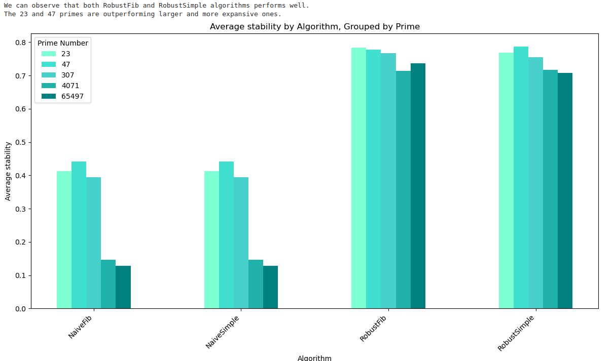

# rlt

`RLT` stands for Robust Lookup Table.
The `RLT` algorithm is defined in `internal/adapter/bpf/ebpf_lookuptable.go`.

## Benchmark analysis

[Benchmark analysis notebook](./benchmark_analysis.ipynb)

